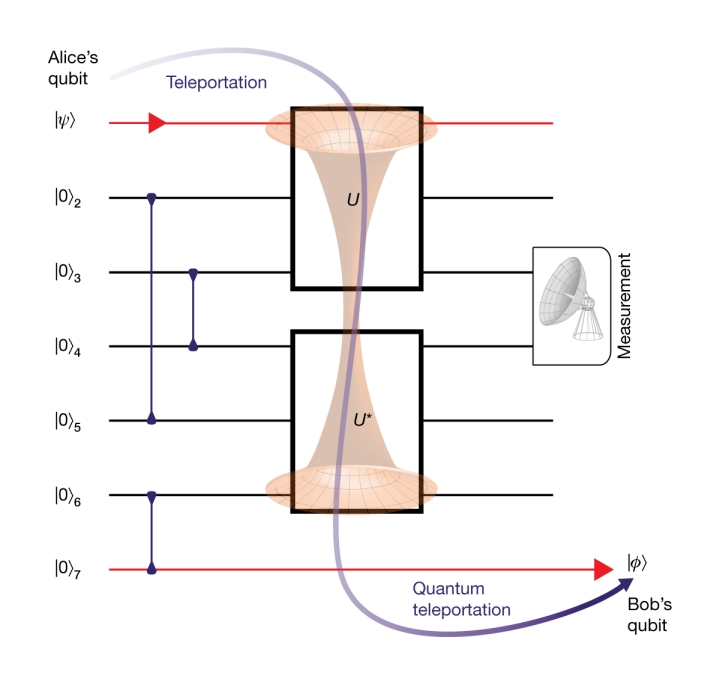

# The Quantum Information Scrambling Verification Test


Reference: [Verified quantum information scrambling [arXiv:1806.02807]](https://arxiv.org/abs/1806.02807)


## BASIC IDEA

Verify scrambling in terms of many-body teleportation fidelity.



## IMPLEMENTATION

Our hardware efficient implementation offers a sandbox to explore the scrambling properties of n-qubit operators, test the scrambling properties of custom gate sets, or apply tunable scrambling to a circuit.


## DEMO


```python

```
